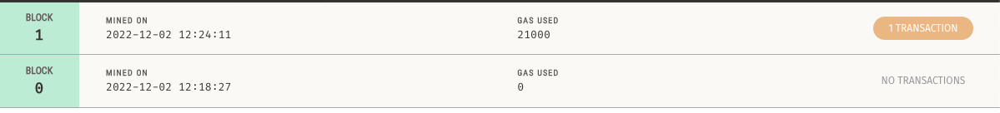

# Fintech Finder

This program is for a disruptive new platform called Fintech Finder. The application allows customers to find fintech professionals, hire them and pay them in cryptocurrency. The task is to integrate the program into the Ethereum blockchain to allow the professionals to be paid immediately.

## Technologies

This application is compatible with Python 3.9.6. (Notice: The program uses Streamlit, which is known to have issues with certain versions of Python. Please make sure you have 3.9.6 for maximum compatibility and to avoid errors when running).

The streamit, dataclasses, typing, web3, os, requests, dotenv and bip44 libraries were used. Web3, bip44, streamlit and dotenv must be installed in order to run the program correctly.

Web3 is allows Python to interact with Ethereum.

Streamlit is used to create custom web apps for machine learning and data science.

Dataclasses provides a decorator and functions for class elements in Python.

Typing provides runtime support for type hints.

OS provides a portable way of using operating system dependent functionality.

Requests allows Python to interact with http speaking applications.

Dotenv allows access to hidden files with sensitive information.

Bip44 allows communicaiton with cryptocurrency wallets and addresses.

This program will work on Windows, MacOS and Linux with Python 3.9.6 installed. The user will need to run the program in a code editor such as Juypter Lab or Visual Studio Code. Alternatively, the program can be run directly from the CLI.

Documentation for the Web3 library can be found [here.](https://web3py.readthedocs.io/en/latest/)

Documentation for the Streamlit library can be found [here.](https://docs.streamlit.io)

Documentation for the dataclasses library can be found [here.](https://docs.python.org/3/library/dataclasses.html)

Documentation for the os library can be found [here.](https://docs.python.org/3/library/os.html)

Documentation for the requests library can be found [here.](https://pypi.org/project/requests/)

Documentation for dotenv can be found [here.](https://pypi.org/project/python-dotenv/)

Documentation for bip44 can be found [here.](https://github.com/bitcoin/bips/blob/master/bip-0044.mediawiki)


---

## Installation Guide

Install the following dependencies before running the program.

To install the web3, streamlit, bip44 and dontenv libraries type the following into your CLI:

```
python
pip install web3
pip install streamlit
pip install bip44
pip install python-dotenv
```
---

## Usage

First, open the folder containing the files in an IDE of your choice. Open the file ```SAMPLE.env```, copy and paste the nmemonic from your wallet in-between the quote marks. Rename the file ```.env``` and save it. This is how the program will be able to access your wallet.

In your CLI, navigate to the folder containing the ```fintech_finder.py``` file.

Input ```conda activate dev``` into your CLI to enter the dev environment.

To run the program simply type ```streamlit run pychain.py```. The program will launch inside of your web browser.

Once the program is loaded, you'll be able to interact with the program and make transactions from your ethereum wallet.

---

## Images of the Program

This is what the interface looks like. As we can see in this example, Ash was chosen for a total of 4 hours.


After the transaction was made, the program validated the transaction hash as shown here.


In Ganache, we can see our new ETH balance after the withdrawl was made.


In Gananche we can see a record that a new block was mined and added to the chain.



And finally in Ganache, we can see a detailed record of the transaction record including the TX hash, both addresses, the amount of ETH sent and gas fees.


---

## Contributors

Developed by:

Graham Johnstone
Email: johnstonegr@gmail.com

---

## License
This code is published under the Creative Commons License, 2022.